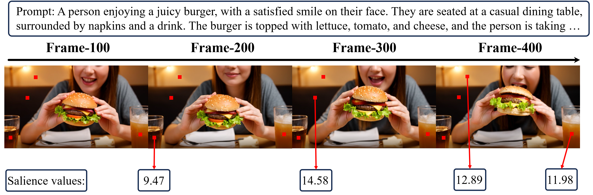

# Permanent Token Occupation Analysis

We conduct an analysis of permanent token occupation for a given prompt, and provide the visualization below. We observe that tokens with high occupation values typically correspond to static backgrounds or objects that remain unchanged throughout the video. These tokens contribute strongly to long-term consistency, resulting in higher scores.

However, this also limits the dynamic aspects of the video, as tokens related to motion or fine-grained changes are less emphasized. Addressing this trade-off between consistency and dynamics is an important direction for future work. We also sincerely thank the reviewer for highlighting this issue.

## Visualization

